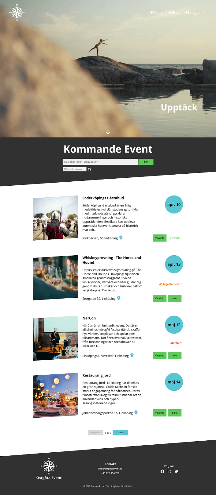
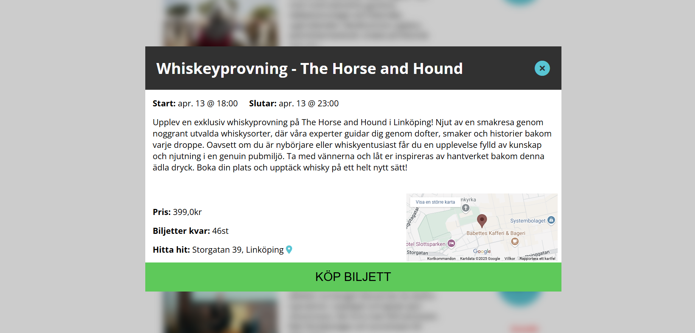
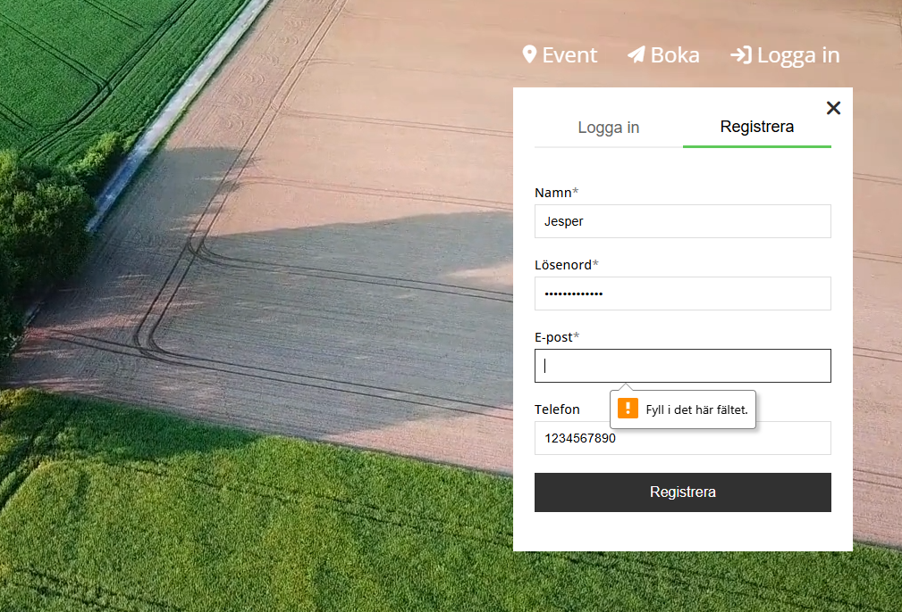
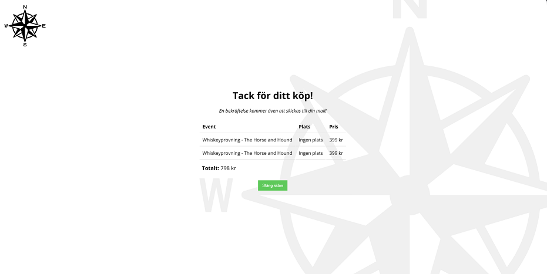
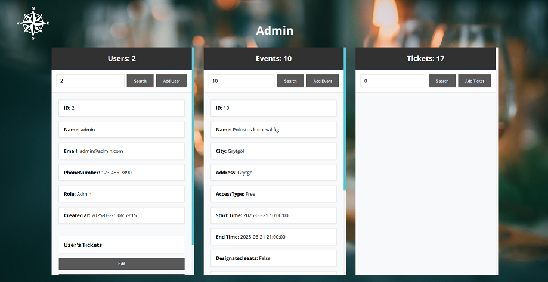

# Östgöta Event [](https://dotnet.microsoft.com/apps/aspnet/web-apps/blazor) [](https://dotnet.microsoft.com/download) 

A modern event ticketing platform for Östergötland County, built with **Blazor WebAssembly** and **.NET 9**.  
Created by Viktor Thörn, Joakim Bjerselius, and Jesper Wallentin.  
>_This is a fictional site created for demonstration purposes, events and data are not real._


## Features

### For Users
- Discover and search for upcoming events
- View purchased tickets and manage user profile
- Secure login and registration (BCrypt)

### For Admins
- Admin dashboard to manage events, users and tickets
- Role-based access with backend verification
- Full CRUD capabilities for system data

## Tech Stack
- **Frontend**: Blazor WASM  
- **Backend**: .NET 9 REST API  
- **Database**: SQLite + EF Core  
- **Auth**: BCrypt & session-based auth  
- **Testing**: Reqnroll + xUnit

## Try it out?

<details>
<summary>Setup and Run</summary>  
  
#### Prerequisites:
- [.NET 9.0.2 SDK](https://dotnet.microsoft.com/en-us/download/dotnet)

``` bash
git clone https://github.com/Ett-bra-team-som-samarbetar-bra/ostgota-event.git &&
cd ostgota-event &&
dotnet build ./Api/Api.csproj &&
dotnet build ./BlazorStandAlone/BlazorStandAlone.csproj
dotnet run --project Api & dotnet run --project BlazorStandAlone
```

#### Access locally:
- **Blazor WASM frontend**: [https://localhost:7059/](https://localhost:7059/)
- **API Swagger UI**: [https://localhost:7189/swagger/index.html](https://localhost:7189/swagger/index.html)  

</details> 

## Images

<details>
<summary><strong>Full Homepage View</strong></summary>



</details>

<details>
<summary><strong>Various Images</strong></summary>
  





</details>

## Contributors 
- [Viktor Thörn](https://github.com/ThoernVE)
- [Jesper Wallentin](https://github.com/Peppson)
- [Joakim Bjerselius](https://github.com/Jockebjers)

[View our KanBan Board](https://github.com/orgs/Ett-bra-team-som-samarbetar-bra/projects/1/views/1)

<br>

Built with ❤️ in Östergötland, Sweden
